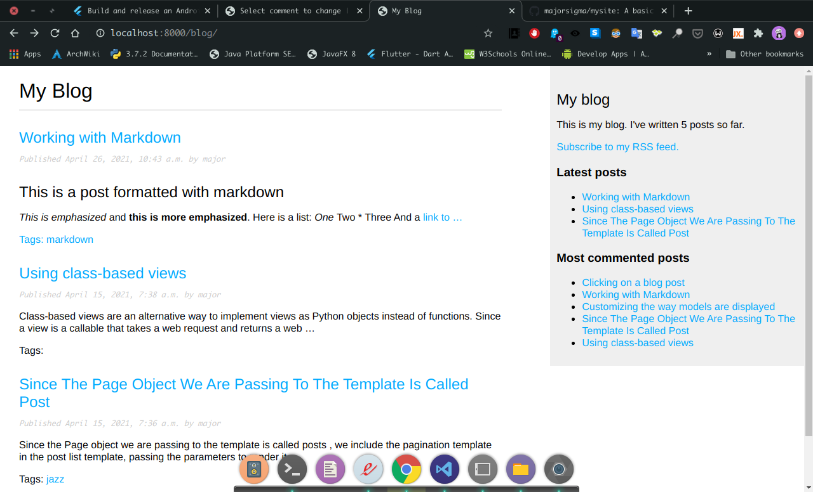
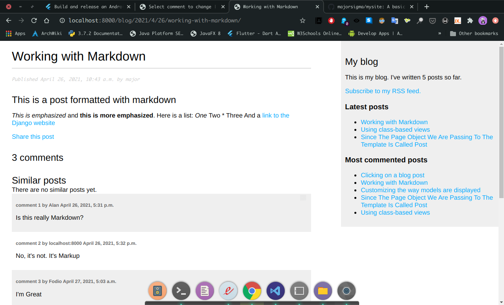
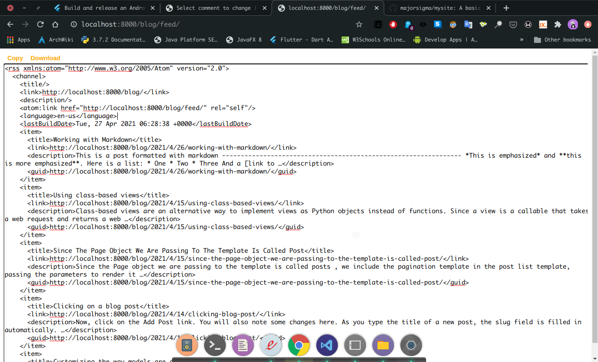
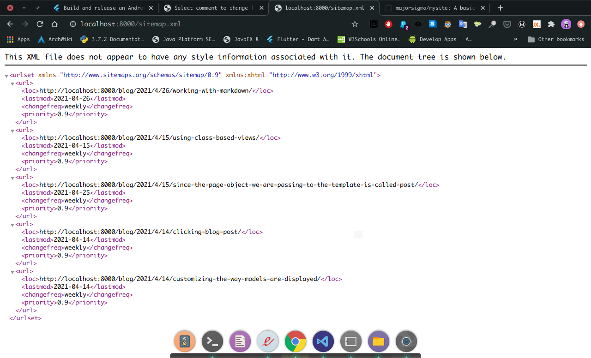

# my site

A simple web blog app built with Python Django framework.

## Getting Started

This app helps users to be able to write blogs. It features a tagging system which enables each post to be tagged based on its characteristics. This app also allow visitors to comment of posts they are interested in. They can also share posts via email with their loved ones. Visitors are also able to easily find most recent and most commented posts.

Among other features are:

- the ability to add blog posts with Markdown support
- blog Sitemap
- Rss Feeds

## Installation

Make sure you have the following installed on your system:

- Python 3
- Django 3.2
- Virtualenv

## Project Dependencies

1. django_taggit

    ```bash  
    pip install django_taggit==0.22.2
    ```

2. Markdown

    ```bash  
    pip install Markdown==2.6.11
    ```

## Running the App

From the project root folder

```bash  
    python manage.py runserver
```

## Screenshots





